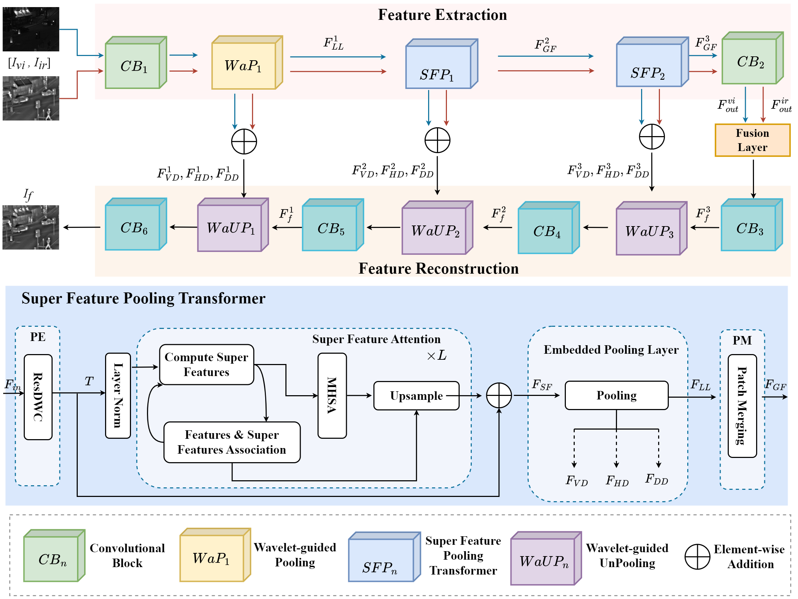

# SFPFusion

This is the code of the paper titled as "SFPFusion: An Improved Vision Transformer Combining Super Feature Attention and Wavelet-Guided Pooling for Infrared and Visible Images Fusion". 

The paper can be found [here](https://www.mdpi.com/1424-8220/23/18/7870#)

# Framework



# Example


# Environment

- Python 3.9.13
- torch 1.12.1
- torchvision 0.13.1
- tqdm 4.64.1

# To Train

We train our network using [MS-COCO 2014](http://images.cocodataset.org/zips/train2014.zip)(T.-Y. Lin, M. Maire, S. Belongie, J. Hays, P. Perona, D. Ramanan, P. Dollar, and C. L. Zitnick. Microsoft coco: Common objects in context. In ECCV, 2014. 3-5.)

You can run the following prompt:

```python
python train_auto_encoder.py
```

# To Test

Put your image pairs in the "test_images" directory and run the following prompt: 

```python
python test_SFPFusion.py
```

# Models

The models for our network can be download from [models](https://pan.baidu.com/s/1wshc30thwem3J8b9l_06FA?pwd=kvh2 ).

The models should be on:

```
'./models/model_SFPFusion/1e1/Final_xx_epoch.model'
```


# Acknowledgement

- Our code of training is based on the [DenseFuse](https://github.com/hli1221/densefuse-pytorch).
- For calculating the image quality assessments, please refer to this [Metric](https://github.com/Linfeng-Tang/Evaluation-for-Image-Fusion).

# Contact Informaiton

If you have any questions, please contact me at <yongbiao_xiao_jnu@163.com>.

# Citation

If this work is helpful to you, please cite it as (BibTeX):

```
@article{li2023sfpfusion,
  title={SFPFusion: An Improved Vision Transformer Combining Super Feature Attention and Wavelet-Guided Pooling for Infrared and Visible Images Fusion},
  author={Li, Hui and Xiao, Yongbiao and Cheng, Chunyang and Song, Xiaoning},
  journal={Sensors},
  volume={23},
  number={18},
  pages={7870},
  year={2023},
  publisher={MDPI}
}
```

